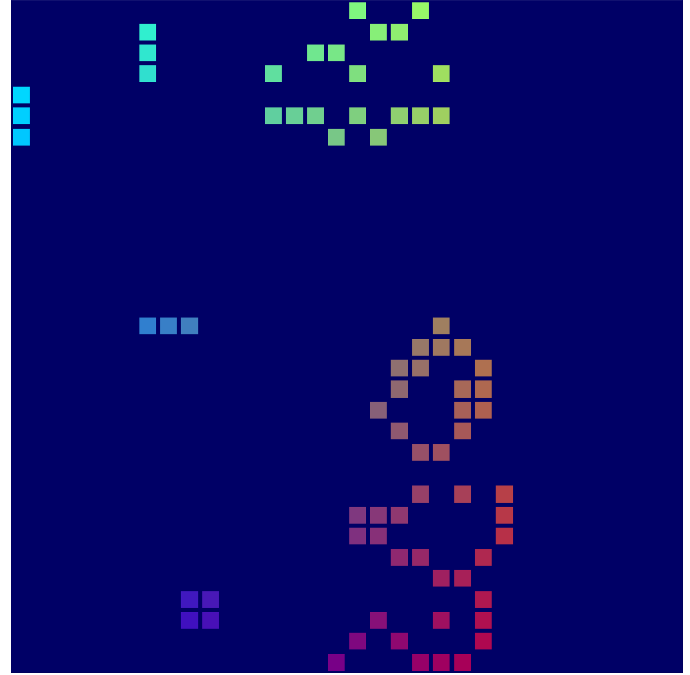
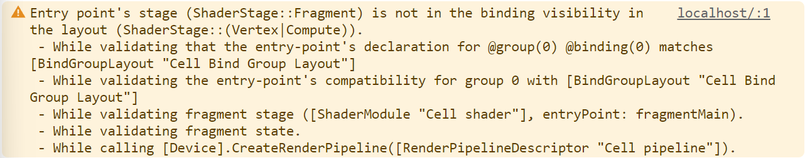

# WebGPU Demo

this project is implemented under the tutorial created by Google. you can read the tutorial here: https://codelabs.developers.google.com/your-first-webgpu-app#0

## Preview

vercel deployment: https://webgpu-demo.vercel.app/



# instruction

## Mistake from tutorial

there is a mistake in google's tutorial which will result in an error below:

```
Entry point's stage (ShaderStage::Fragment) is not in the binding visibility in the layout (ShaderStage::(Vertex|Compute)).
 - While validating that the entry-point's declaration for @group(0) @binding(0) matches [BindGroupLayout "Cell Bind Group Layout"]
 - While validating the entry-point's compatibility for group 0 with [BindGroupLayout "Cell Bind Group Layout"]
 - While validating fragment stage ([ShaderModule "Cell shader"], entryPoint: fragmentMain).
 - While validating fragment state.
 - While calling [Device].CreateRenderPipeline([RenderPipelineDescriptor "Cell pipeline"]).
```



you can fix it by add a `GPUShaderStage.FRAGMENT` to the `bindGroupLayout.entries[0].visibility` like below:

```ts
const bindGroupLayout = device.createBindGroupLayout({
  label: 'Cell Bind Group Layout',
  entries: [
    {
      binding: 0,
      visibility:
        GPUShaderStage.VERTEX |
        GPUShaderStage.COMPUTE |
        GPUShaderStage.FRAGMENT, // this is where the tutorial gets wrong.
      buffer: {},
    },
    {
      binding: 1,
      visibility: GPUShaderStage.VERTEX | GPUShaderStage.COMPUTE,
      buffer: { type: 'read-only-storage' },
    },
    {
      binding: 2,
      visibility: GPUShaderStage.COMPUTE,
      buffer: { type: 'storage' },
    },
  ],
});
```
